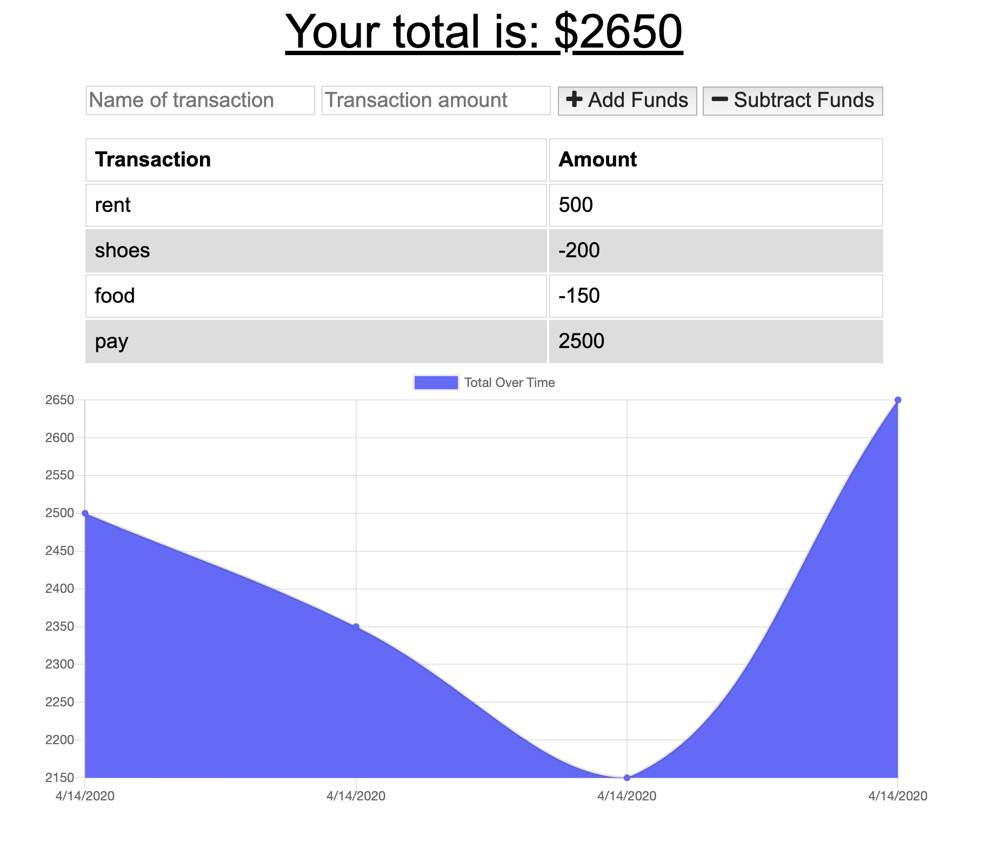

# Budget Tracker
## Created by: bg9892

## Index
1. [Description](#description)
2. [Installation](#installation)

### Deployed App

### Description
A budget tracking app where you can add or subtract an item, dollar amount, and track on a graph. App uses indexedDB and service worker so it will work if you lose internet connection.

### Installation
npm install
run npm start

# Screenshots

